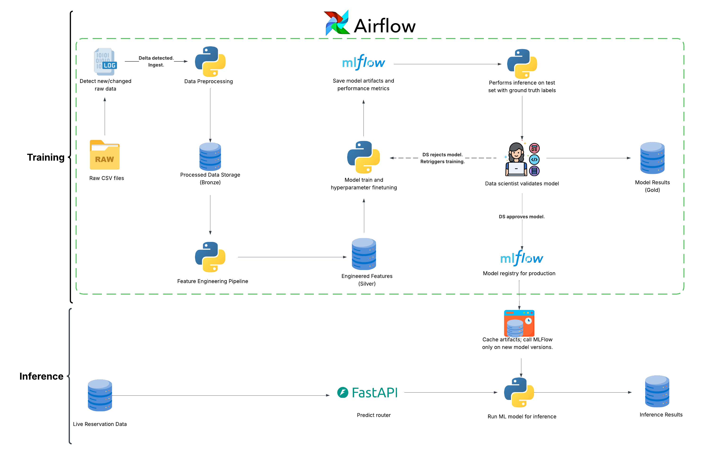
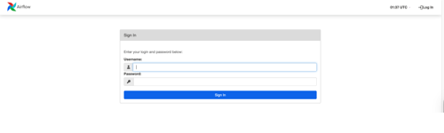
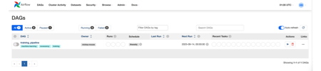
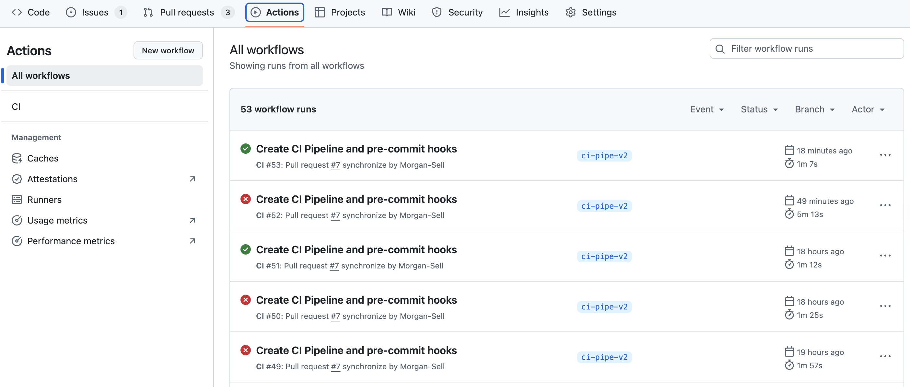

# NoVacancy
NoVacancy is a machine learning application that predicts hotel reservation cancellations using historical booking data. The dataset is sourced from [ScienceDirect](https://www.sciencedirect.com/science/article/pii/S2352340918315191) and contains approximately 36,000 reservations from two hotels (one resort, one urban) with arrival dates between July 1, 2015, and August 31, 2017. The dataset includes 17 features, with cancellation status serving as the binary target variable.


### Technology Stack
NoVacancy is built on a modular, containerized architecture featuring:

- **API Framework**: FastAPI for RESTful prediction services
- **Data Storage**: PostgreSQL with medallion architecture (Bronze/Silver/Gold layers)
- **ML Operations**: MLflow for experiment tracking and model registry
- **Infrastructure**: Docker Compose for container orchestration
- **CI/CD**: GitHub Actions for automated linting, testing and deployment
- **Database Migrations**: Alembic for schema version control
- **Orchestration**: Airflow for workflow management and scheduling
- **Data Validation**: Great Expectations for pipeline-level data quality checks (planned)
- **Model Monitoring**: Evidently AI for drift detection and performance monitoring (planned)


### Data Science Foundation
The machine learning pipeline and preprocessing strategies are based on comprehensive exploratory data analysis available in the [EDA notebook](https://github.com/Morgan-Sell/no-vacancy/blob/analysis/no_vacancy_eda.ipynb).

## System Architecture

The system implements a [medallion architecture](https://www.databricks.com/glossary/medallion-architecture) with integrated MLOps workflows, enabling automated model training, validation, and deployment with human oversight for production model promotion.

<p align="center">
   
</p>


## Feature Branch History

### `orchestration`
Integrated Apache Airflow orchestration for the machine learning pipeline via Docker containers. The system executes a five-task workflow: data import, model training, prediction generation, artifact validation, and cleanup operations. This branch demonstrates production-ready ML pipeline orchestration with proper dependency management and error handling.

1. Clone the repo.
   ```
    git clone https://github.com/Morgan-Sell/no-vacancy.git
   ```

2. Switch to `orchestration` feature branch.
   ```
   git checkout orchestration
   ```

3. Start the orchestration and training services.
   ```
   docker compose --profile airflow --profile training up -d
   ```

4.Access the Airflow web interface at `http://localhost:8080`. You'll see the login page.

<p align="center">
   
</p>

5. Log in using:
   - **Username**: `homer`
   - **Password**: `waffles`

6. After successful authentication, the Airflow dashboard displays the `training_pipeline` DAG with its linear task dependencies.

<p align="center">
   
</p>

7. The DAG can be triggered manually or runs on its scheduled interval (weekly). Each task executes in isolated Docker containers with proper dependency management between data processing, training, and validation stages.


### `ci-pipe-v2`
Implemented a CI pipeline with GitHub Actions for automated linting and testing. Enhanced the MLflow integration to provide complete model lifecycle management - the system now logs trained models and preprocessing artifacts in `trainer.py` and retrieves them for inference in `predictor.py`, enabling consistent model versioning and deployment.

1. Clone the repo.
   ```
    git clone https://github.com/Morgan-Sell/no-vacancy.git
   ```

2. Switch to `ci-pipe-v2` feature branch.
   ```
   git checkout ci-pipe-v2
   ```

3. Add the following GitHub secrets:
   - `BRONZE_DB`
   - `BRONZE_DB_HOST`
   - `DB_PASSWORD`
   - `DB_PORT`
   - `DB_USER`
   - `GOLD_DB`
   - `GOLD_DB_HOST`
   - `MLFLOW_DB`
   - `MLFLOW_DB_HOST`
   - `MLFLOW_TRACKING_URI`
   - `SILVER_DB`
   - `SILVER_DB_HOST`
   - `TEST_DB`
   - `TEST_DB_HOST`
   - `TEST_DB_PASSWORD`
   - `TEST_DB_PORT`
   - `TEST_DB_USER`

4. Every time code changes are pushed to GitHub, the CI pipeline will be executed. To see the CI pipeline results, navigate to the **Actions** tab. Here you will see a list of all completed workflows.
<p align="center">
   
</p>

5. The CI pipeline only checks code style; it doesn't fix the code. To enable auto-fixing, `.pre-commit-config.yaml` was created. Before committing/pushing your code changes to GitHub, run the following code in your terminal
   ```
   pre-commit run --all-files --config .pre-commit-config.yaml
   ```


### `mlflow`
When `NoVacancyPipeline` is trained, model artifacts and experimentation results are saved to MLflow repository.

1. Clone the repo.
   ```
    git clone https://github.com/Morgan-Sell/no-vacancy.git
   ```

2. Switch to `mlflow` feature branch.
   ```
   git checkout mlflow
   ```

3. Create a `.env` file in the project root directory with the following variables:
   - DB_USER
   - DB_PASSWORD
   - DB_PORT
   - BRONZE_DB_HOST
   - BRONZE_DB
   - SILVER_DB_HOST
   - SILVER_DB
   - GOLD_DB_HOST
   - GOLD_DB
   - TEST_DB_USER
   - TEST_DB_PASSWORD
   - TEST_DB_HOST
   - TEST_DB
   - TEST_DB_PORT
   - MLFLOW_DB_HOST
   - MLFLOW_DB
   - MLFLOW_TRACKING_URI

4. Build Docker image defined in `docker-compose.yaml`.
   ```
   docker compose build
   ```

5. Start all docker services in detached mode.
   ```
   docker compose up -d
   ```

6. Identify the container ID by running
   ```
   docker ps -a
   ```

7. Once you've identified the container ID associated with the image called `no-vacancy-app` enter the following to access the application:
   ```
   docker exec -it <container_id> /bin/bash
   ```

8 Train the NoVacancyPipeline in a Docker container by running
   ```
   python services/trainer.py
   ```

9. Enter `http://localhost:5001` into your web browser. Your web browser disply MLflow. In the Experiments sidebar, you should see **NoVacancyModelTraining**. Select it and you will see the model artifacts.


### `postgres`
Implements medallion architecture and reads `/data/bookings_raw.csv` into the `raw_data` table in the Bronze database.

1. Clone the repo.
   ```
    git clone https://github.com/Morgan-Sell/no-vacancy.git
   ```

2. Switch to `postgres` feature branch.
   ```
   git checkout postgres
   ```

3. Create a `.env` file in the project root directory with the following variables:
   - DB_USER
   - DB_PASSWORD
   - DB_PORT
   - BRONZE_DB_HOST
   - BRONZE_DB
   - SILVER_DB_HOST
   - SILVER_DB
   - GOLD_DB_HOST
   - GOLD_DB
   - TEST_DB_USER
   - TEST_DB_PASSWORD
   - TEST_DB_HOST
   - TEST_DB
   - TEST_DB_PORT

4. Build Docker image defined in `docker-compose.yaml`.
   ```
   docker compose build
   ```

5. Start all docker services in detached mode.
   ```
   docker compose up -d
   ```

6. Enter `http://127.0.0.1:8000/` into your web browser. Your web browser should generate the below text.
   ```
   {"message":"Welcome to the No Vacancy API!"}
   ```

7. Identify the container ID by running
   ```
   docker ps -a
   ```

8. Once you've identified the container ID associated with the image called `no-vacancy-app` enter the following to access the application:
   ```
   docker exec -it <container_id> /bin/bash
   ```

9. Now that you're in the application you can query the data from `raw_data` table. Enter the code below in your command line to access PostgreSQL and see the first 10 lines of the `raw_data` table.
    ```
    docker exec -it bronze-db psql -U <db_user_from_dotenv> -d <bronze_db_from_dotenv>

    SELECT * FROM raw_data LIMIT 10;
    ```

10. Since the `raw_data` table has been populated, you can process the data and save the data to `novacancy-silver` database and train the model using the `NoVacancyPipeline` class. Once you're inside the Docker container (by following instruction #8), execute the following code:
    ```
    python services/trainer.py
    ```

   If the application successfully runs, you should see some like the following:
   ```
   2025-05-14 00:43:16,688 - __main__ - INFO -train_pipeline:116 - ✅ Loaded raw data
   2025-05-14 00:43:19,010 - __main__ - INFO -train_pipeline:126 - ✅ Saved preprocessed data to Silver database
   Fitting 3 folds for each of 20 candidates, totalling 60 fits
   2025-05-14 00:43:34,575 - services.pipeline_management - INFO -save_pipeline:39 - ✅ Pipeline and processor successfully saved at models/no_vacancy_pipeline.pkl
   2025-05-14 00:43:34,740 - __main__ - INFO -evaluate_model:98 - 0.0.3 - AUC: 1.0
   ```


### `web-server`
FastAPI web server comprised of the routers and the services required to process the data, perform feature engineering, train the model, save model artifacts and produce predictions.

1. Clone the repo.
   ```
    git clone https://github.com/Morgan-Sell/no-vacancy.git
   ```

2. Switch to `web-server` feature branch.
   ```
   git checkout web-server
   ```

3. Build the Docker image (replace <docker_username> with your Docker Hub username). Make sure Docker is running on your local PC.
   ```
   docker build -t <docker_username>/no-vacancy:v1 .
   ```

4. Run the container.
   ```
   docker run -it -p 8000:8000 <docker_username>/no-vacancy:v1
   ```

5. Test the API by going to `http://0.0.0.0:8000/docs` in your browser.
